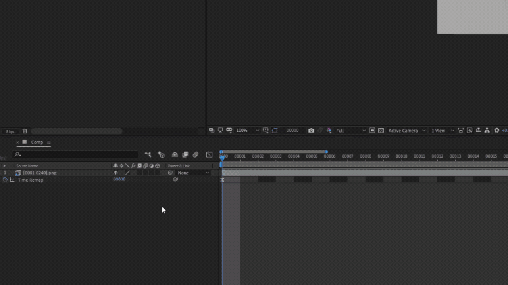

# Velocity3D
 A series of scripts to apply velocity from After Effects and Sony Vegas to 3D Packages
 

## .Velo File Format

JSON Serialized dictionary

Key = String index for frame (real time)

Value = Frame number to be mapped to real time frame.

 
 
 ## How To Use:

### Blender:

1. Apply a time remap to slow down the current animation

2. Viewport render to AVI

3. Apply Time Remapping to that render in After Effects

4. Export Velocity File

5. Use Velocity Render script in Blender to render only the required frames

6. DONE!

### Maya:

1. Use Velocity plugin to create Velocity Controller

2. Use Velocity Controller to set a desired timescale

3. Apply this timescale using Velocity Plugin

4. Playblast render viewport to avi

5. Apply Time Remapping in After Effects

6. Export Velocity File

7. Apply Velocity in Maya using Velocity Plugin
