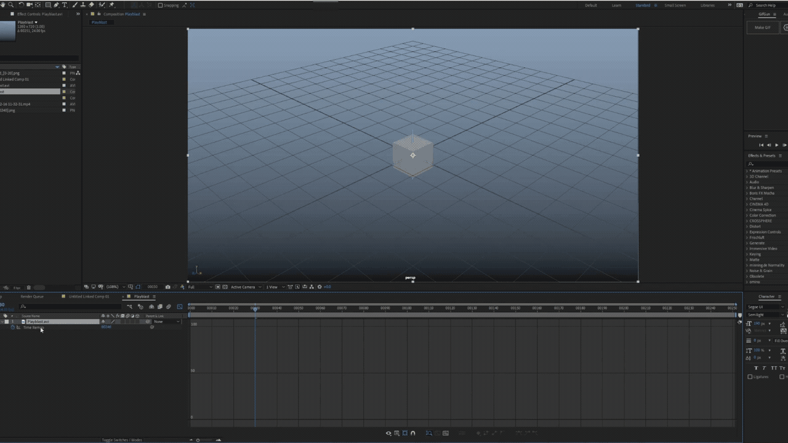

# Velocity3D
 A series of scripts to apply velocity from After Effects and Sony Vegas (Soon) to 3D Packages
 

## .Velo File Format

JSON Serialized dictionary

Key = String index for frame (real time)

Value = Frame number to be mapped to real time frame.

### Supported Applications:
#### 3D Software:
- [Blender](https://github.com/Airyzz/Velocity3D#blender)
- [Maya](https://github.com/Airyzz/Velocity3D#maya)
- [Unreal Engine 4](https://github.com/Airyzz/Velocity3D#unreal-engine)

#### Video Editors:
- Adobe After Effects

### Coming Later:
#### 3D Software:
- Cinema 4D

#### Video Editors:
- Sony Vegas
 
 ## How To Use:

### Blender:

1. Apply a time remap to slow down the current animation (Optional, but recommended. Will give you more frames to work with while applying velo)

2. Viewport render to AVI

3. Apply Time Remapping to that render in After Effects

4. Export Velocity File

5. Use Velocity Render script in Blender to render only the required frames (Recommending to turn on the system console to see progress of render, as it will not show the usual render window)

6. DONE!

### Maya:

1. Use Velocity plugin to create Velocity Controller

2. Use Velocity Controller to set a desired timescale (Optional, but recommended. Will give you more frames to work with while applying velo)

3. Apply this timescale using Velocity Plugin (Optional, see above)

4. Playblast render viewport to avi

5. Apply Time Remapping in After Effects

6. Export Velocity File

7. Apply Velocity in Maya using Velocity Plugin

### Unreal Engine:
Gif Guides coming soon

#### First Time Setup:
1. go to Edit > Plugins
2. Search for 'script'
3. Enable: 'Python Editor Script Plugin', 'Sequencer Scripting', and 'Editor Scripting Utilities'

#### Working with Velo
1. Do a low quality render of your sequence
2. Apply velo to low quality render in AE
3. Export .Velo file
4. In UE4 Content Browser, select your original sequence, and execute the velocity.py script
5. Select your .velo file in the dialog
6. A new sequence will be created next to the original with your applied velo
